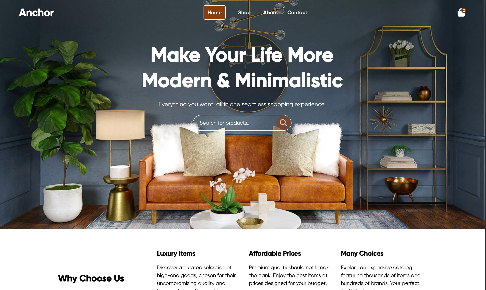
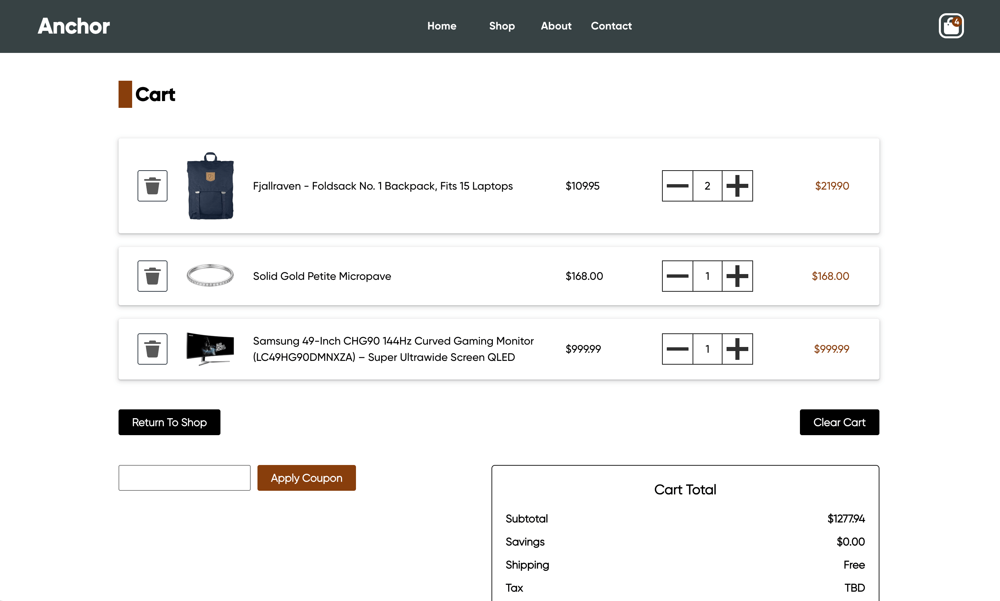
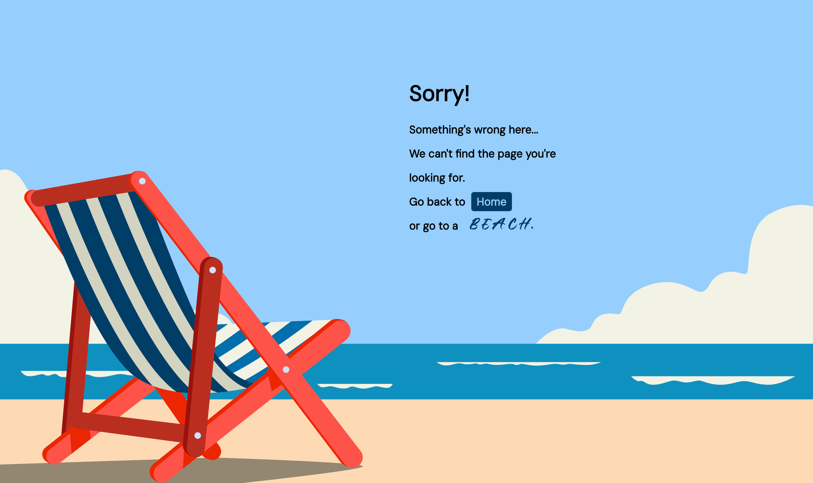

# Shopping Cart (The Odin Project)

This is a solution to the [Shopping Cart Project](https://www.theodinproject.com/lessons/node-path-react-new-shopping-cart) as part of The Odin Project curriculum. 

## Table of contents

- [Shopping Cart (The Odin Project)](#shopping-cart-the-odin-project)
  - [Table of contents](#table-of-contents)
  - [Overview](#overview)
    - [Screenshots](#screenshots)
    - [Links](#links)
  - [Credits](#credits)
    - [Images](#images)
    - [Icons](#icons)
    - [Fonts](#fonts)
    - [Design Templates](#design-templates)
    - [Useful resources](#useful-resources)

## Overview

This is a mock e-commerce site developed using React and CSS. It serves as a single-page application demonstrating the use of state management, React Router and interaction with a simulated data source. The site provides a user-friendly interface with a Home page, a Shop page which displays a list of available products and a Cart page with items added to the cart. The site is responsive and designed to work on different screen sizes.

### Screenshots

<table>
  <tr>
    <td align="center">
      
       
      <em>Homepage - Desktop </em>
    </td>
    <td align="center">
      
       
      <em>Shop page - Desktop </em>
    </td>
  </tr>
  <tr>
    <td align="center">
      
       
      <em>Cart - Desktop</em>
    </td>
    <td align="center">
      
       
      <em>Error page - Desktop</em>
    </td>
  </tr>
</table>

### Links

- [Solution URL](https://github.com/py-code314/shopping-cart)
- [Live Site URL]()

## Credits

### Images

- Background image for Hero section - "brown wooden round table with chairs" by Spacejoy on [Unsplash](https://unsplash.com/photos/brown-wooden-round-table-with-chairs-kz_xZG9ufbk)
- Background image for Error page - "A beach chair awaits summer relaxation" by Yusuf Saibani on [Unsplash](https://unsplash.com/illustrations/a-beach-chair-awaits-summer-relaxation-Sr3E5JvZ-x4)

### Icons

- Shopping bag icon is from [SVG Repo](https://www.svgrepo.com/) 
- Social media icons are from [streamline](https://www.streamlinehq.com/) 
- All other icons are from [Reshot](https://www.reshot.com/)

### Fonts

- Gilroy font is from [font.download](https://font.download/font/gilroy-bold)
- Eagle Horizon font is from [1001fonts.com](https://www.1001fonts.com/eagle-horizon-personal-use-font.html)
- Inter & DM Sans fonts are from [Google Fonts](https://fonts.google.com/)
- All fonts are converted using [Font Squirrel Webfont Generator](https://www.fontsquirrel.com/tools/webfont-generator)

### Design Templates

- Landing page design template from [Figma](https://www.figma.com/community/file/1061732519182077733/panto-furniture-landing-page-design)
- Cart page design template from [Figma](https://www.figma.com/community/file/1219312065205187851/full-e-commerce-website-ui-ux-design)

### Useful resources

- Products data source - [Fake Store API](https://fakestoreapi.com/)
- Box shadows generator - [getcssscan.com](https://getcssscan.com/css-box-shadow-examples)
- Spinning animation - [CSS Loaders](https://css-loaders.com/spinner/)

